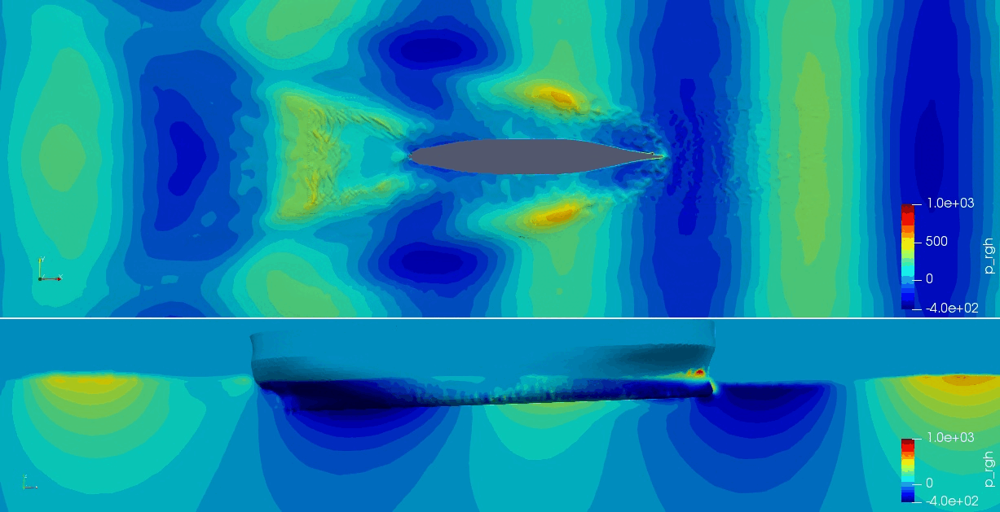

# openfoam_ship_hydrodynamics
This repository contains OpenFOAM implementations for ship hydrodynamics in heading wave simulations.

# Cite
If you use this work in your research, please cite the following papers:

```
@article{wei2022fully,
  title={A fully coupled CFD-DMB approach on the ship hydroelasticity of a containership in extreme wave conditions},
  author={Wei, Yujia and Incecik, Atilla and Tezdogan, Tahsin},
  journal={Journal of Marine Science and Engineering},
  volume={10},
  number={11},
  pages={1778},
  year={2022},
  publisher={MDPI}
}

@article{wei2023hydroelasticity,
  title={A hydroelasticity analysis of a damaged ship based on a two-way coupled CFD-DMB method},
  author={Wei, Yujia and Incecik, Atilla and Tezdogan, Tahsin},
  journal={Ocean Engineering},
  volume={274},
  pages={114075},
  year={2023},
  publisher={Elsevier}
}
```

# Mesh generation
BlockMesh
surfaceFeatureExtract
toposet
refineMesh
snappyHexMesh

# incompressible flow
interfoam


<table>
  <tr>
    <th>Ship motions</th>
    <th>signals</th>
  </tr>
  <tr>
    <td></td>
    <td></td>
  </tr>
</table>. I want single image
